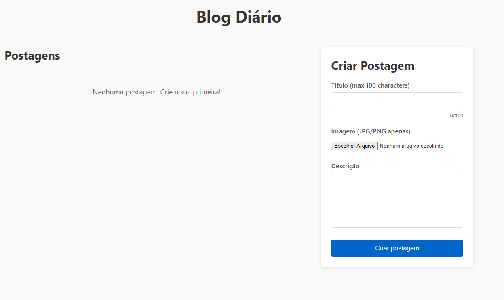

# Projeto Diário

<p align="center">
  
</p>

Uma aplicação full-stack para registrar atividades diárias em formato de entradas de blog. Desenvolvida com **React.js**, **Node.js** e **MongoDB**.

## Funcionalidades

- Criar entradas no diário com título, foto e texto  
- Visualizar todas as entradas em um feed na página inicial  
- Visualizar entradas detalhadas em uma página separada  
- Geração automática de data e hora  
- Funcionalidade de upload de imagens


## Visão do projeto

<p align="center">
  
</p>

## Primeiros Passos

### Pré-requisitos

- Node.js (v14 ou superior)  
- MongoDB (instalação local ou MongoDB Atlas)  

### Instalação

1. Clone o repositório:
   
   ```git clone https://github.com/guilhermexL/blog-diario.git```

2. Configure o backend:

    ```  
    cd backend
    npm install
    ```

3. Crie um arquivo `.env` no diretório `backend` com o conteúdo:

   ```
   MONGO_URI=mongodb://localhost:27017/daily-journal
   PORT=5000
   ```
   > 💡 Substitua o `MONGO_URI` com sua string de conexão do MongoDB Atlas, se necessário.

4. Crie a pasta de uploads:

   ```
   mkdir uploads
   ```

5. Configure o frontend:

   ```
   cd ../frontend
   npm install
   ```

### Executar

1. Inicie o servidor backend:

   ```
   cd backend
   npm run dev
   ```

2. Inicie o frontend:

   ```
   cd frontend
   npm start
   ```

> 💡 Lembre-se de executar em termais diferentes.

3. Acesse em seu navegador: [http://localhost:3000](http://localhost:3000)

## Endpoints da API

* `GET /api/entries` - Buscar todas as entradas
* `GET /api/entries/:id` - Buscar uma entrada específica
* `POST /api/entries` - Criar nova entrada
* `DELETE /api/entries/:id` - Excluir entrada

## Esquema do MongoDB

```
{
  _id: ObjectId,           
  dateTime: Date,          
  title: String,           
  photo: String,           
  text: String,            
  createdAt: Date,         
  updatedAt: Date          
}
```

## Autor

- [Guilherme Santos](https://www.linkedin.com/in/guilhermee-santos/)
- [Análise e Desenvolvimento de Sistemas](https://estudante.ifpb.edu.br/cursos/346/) - IFPB - Campus Esperança